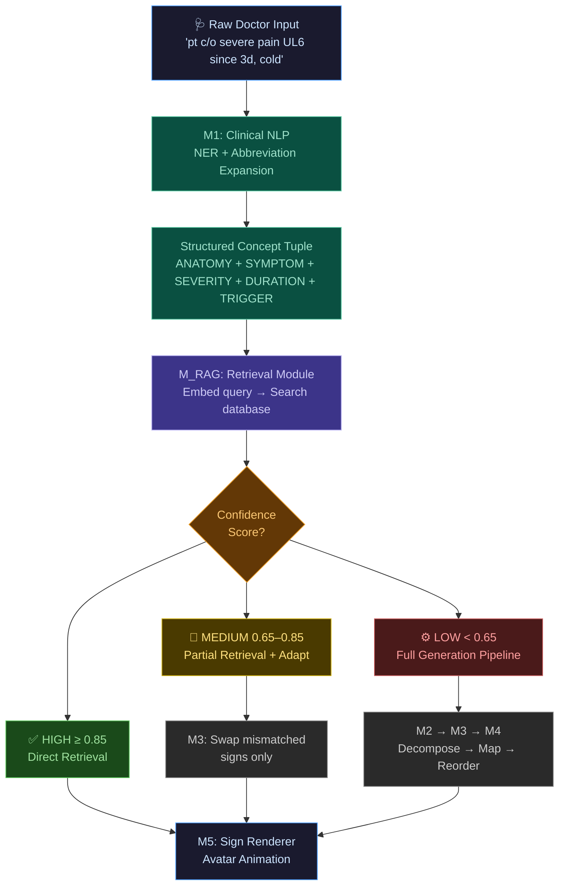
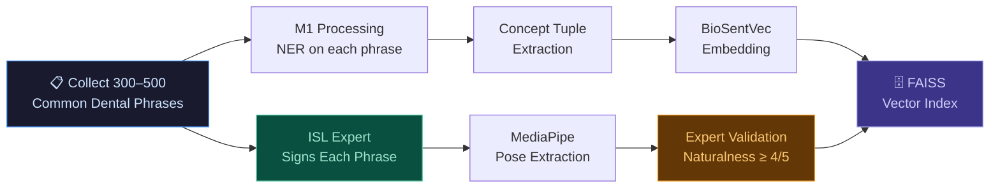
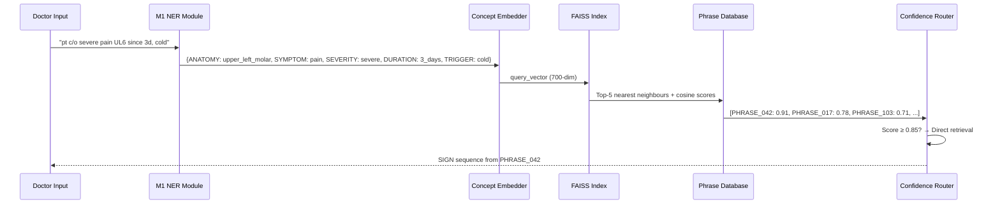
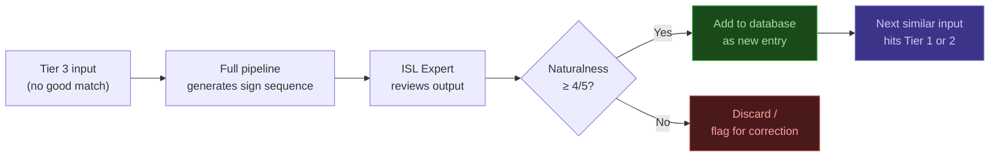
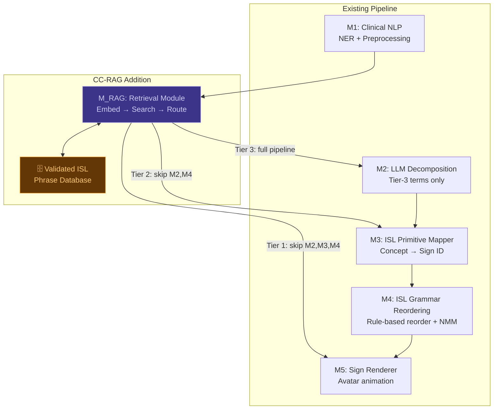

# ISL-RAG

# RAG-Based Sign Retrieval for ISL Dental Translation

## Why RAG? — The Structural Argument

The current pipeline (M1→M5) **generates** a sign sequence from scratch for every input — even when the same dental scenario appears dozens of times a day. This creates three fundamental problems:

| Problem | Current Pipeline | RAG Solution |
|---------|-----------------|--------------|
| **Redundant generation** | "Rinse with warm water" is decomposed, mapped, reordered, and rendered fresh every single time | Retrieved directly from validated database — sub-100ms response for common phrases |
| **Quality ceiling** | Generated signs are only as good as the pipeline — NER errors, wrong sign mappings, and grammar mistakes compound | Retrieved phrases are expert-validated at indexing time — quality is guaranteed for high-confidence hits |
| **No learning from expertise** | ISL expert input is used only to build static rules and vocabularies — not captured as reusable signed content | Expert-signed phrases are stored as first-class entries — the system accumulates and reuses ISL expertise directly |

> [!IMPORTANT]
> The core insight: **Dental consultations are highly repetitive.** A clinic sees the same complaints, procedures, and instructions daily. A retrieval system that recognises this repetition and short-circuits the generation pipeline is both faster and higher quality for the majority of real-world inputs. Generation is the fallback, not the default.

---

## Architecture Overview: Clinical-Concept RAG (CC-RAG)

The architecture adds one new module — **M_RAG** — between M1 and M2. It intercepts the structured NER output, queries a validated ISL phrase database, and either returns a retrieved sign sequence directly or passes control to the generation pipeline.



---

## The CC-RAG Database — Structure and Construction

### What Gets Stored

Each entry in the database is a **validated ISL phrase record** with four fields:

```
{
  "id": "PHRASE_042",
  "english": "You have a cavity in your upper left molar",
  "concept_tuple": {
      "ANATOMY":    "upper_left_molar",
      "CONDITION":  "cavity",
      "SEVERITY":   null,
      "PROCEDURE":  null,
      "DURATION":   null,
      "TRIGGER":    null,
      "INSTRUCTION":null
  },
  "concept_embedding": [0.23, 0.87, 0.45, ...],   // 700-dim BioSentVec vector
  "sign_sequence": ["SIGN_042", "SIGN_031", "SIGN_077", "SIGN_118"],
  "nmm_flags": { "SIGN_077": ["furrowed_brow"] },
  "validated_by": "ISL_expert_session_3",
  "confidence": 1.0
}
```

> [!TIP]
> The `concept_embedding` is computed from the **concept tuple**, not the English sentence. This means "UL6 hurts bad in cold" and "severe pain upper left molar cold sensitivity" produce similar embeddings because M1 normalises them to the same structured output before embedding. This is the key difference from standard text RAG.

### Database Construction Pipeline



### Phrase Category Distribution (Target Database)

| Category | Example Phrases | Target Count |
|----------|----------------|-------------|
| Diagnosis delivery | "You have a cavity / infection / abscess" | ~80 |
| Symptom confirmation | "Is the pain sharp / dull / throbbing?" | ~60 |
| Procedure explanation | "I will clean / fill / extract / drill" | ~70 |
| Post-op instructions | "Rinse / avoid / take medication / rest" | ~80 |
| Appointment + follow-up | "Come back in 3 days / one week" | ~40 |
| Emergency phrases | "Open wide / bite down / don't move" | ~30 |
| **Total** | | **~360** |

---

## The Query Mechanism — Structured Concept Embedding

### Why Not Just Embed the Text?

Standard RAG embeds raw text. The problem: doctors write inconsistently.

```
"pt c/o severe pain UL6"
"upper left molar hurts a lot"  
"dard bahut zyada hai upar left mein"   ← Hinglish
"severe toothache upper left side"
```

All four mean the same thing. Text embeddings of these four sentences will cluster loosely but not tightly — especially the Hinglish one.

After M1 processing, all four produce:

```
ANATOMY:   upper_left_molar
SYMPTOM:   pain
SEVERITY:  severe
```

Embed **this** instead. Now all four queries produce nearly identical embedding vectors. Retrieval becomes language-agnostic and phrasing-agnostic.

### Embedding Construction

```python
def build_concept_embedding(concept_tuple: dict) -> np.ndarray:
    """
    Converts structured NER output into a single 700-dim embedding
    by concatenating weighted BioSentVec embeddings per slot.
    """
    slot_weights = {
        'ANATOMY':    1.4,   # Most discriminative for dental domain
        'SYMPTOM':    1.3,
        'PROCEDURE':  1.3,
        'SEVERITY':   0.8,
        'DURATION':   0.6,
        'TRIGGER':    0.9,
        'INSTRUCTION':1.1,
    }
    
    weighted_embeddings = []
    for slot, value in concept_tuple.items():
        if value is not None:
            vec = biosentvec.embed(value)           # 700-dim
            weighted_embeddings.append(vec * slot_weights[slot])
    
    # Mean pool across filled slots
    concept_vector = np.mean(weighted_embeddings, axis=0)
    return concept_vector / np.linalg.norm(concept_vector)  # L2 normalise
```

### Retrieval Query Flow



---

## The Three-Tier Confidence System

This is the architectural core of CC-RAG. Every retrieval attempt produces a score, and that score determines which path the input takes.

```mermaid
flowchart TD
    subgraph "TIER 1 — Direct Retrieval  score ≥ 0.85"
        T1A["Retrieve top match"]
        T1B["Return sign sequence as-is"]
        T1C["Render in M5"]
        T1A --> T1B --> T1C
    end

    subgraph "TIER 2 — Adapted Retrieval  0.65 ≤ score < 0.85"
        T2A["Retrieve top match"]
        T2B["Identify mismatched concept slots\ne.g. retrieved has DURATION=1_week\nbut query has DURATION=3_days"]
        T2C["Pass mismatched slots only\nto M3 for sign swap"]
        T2D["Splice new signs into\nretrieved sequence"]
        T2E["Render in M5"]
        T2A --> T2B --> T2C --> T2D --> T2E
    end

    subgraph "TIER 3 — Full Generation  score < 0.65"
        T3A["No good match found"]
        T3B["Pass to M2 → M3 → M4"]
        T3C["Store result if\nexpert validates it\n→ grows database"]
        T3A --> T3B --> T3C
    end

    style T1A fill:#1a4a1a,stroke:#5dca5d,color:#9fe19f
    style T1B fill:#1a4a1a,stroke:#5dca5d,color:#9fe19f
    style T1C fill:#1a4a1a,stroke:#5dca5d,color:#9fe19f
    style T2A fill:#4a3a00,stroke:#caaa00,color:#ffe180
    style T2B fill:#4a3a00,stroke:#caaa00,color:#ffe180
    style T2C fill:#4a3a00,stroke:#caaa00,color:#ffe180
    style T2D fill:#4a3a00,stroke:#caaa00,color:#ffe180
    style T2E fill:#4a3a00,stroke:#caaa00,color:#ffe180
    style T3A fill:#4a1a1a,stroke:#ca5d5d,color:#ffa0a0
    style T3B fill:#4a1a1a,stroke:#ca5d5d,color:#ffa0a0
    style T3C fill:#4a1a1a,stroke:#ca5d5d,color:#ffa0a0
```



### Tier 2 Slot-Level Adaptation — Worked Example

Retrieved phrase: *"You have pain in upper left molar for 1 week"*
Query: *"severe pain UL6 for 3 days, worsening on cold"*

| Concept Slot | Retrieved | Query | Match? |
|---|---|---|---|
| ANATOMY | upper_left_molar | upper_left_molar | ✅ Keep |
| SYMPTOM | pain | pain | ✅ Keep |
| SEVERITY | null | severe | ❌ Add SIGN_severe |
| DURATION | 1_week | 3_days | ❌ Swap signs |
| TRIGGER | null | cold | ❌ Add SIGN_cold |

Only 3 slots need M3 processing. The rest of the retrieved sequence is used as-is. This is far cheaper than full M2→M3→M4 generation.

---

## Database Growth — The Flywheel Effect

CC-RAG gets better over time through a **feedback loop**:



This means:
- Month 1: 30% of inputs hit Tier 1/2 (small database)
- Month 6: 65–70% of inputs hit Tier 1/2 (database has grown from real clinic usage)
- The system improves passively as the clinic uses it

---

## Worked Example: End-to-End

**Doctor types**: `"pt c/o severe pain UL6 since 3d, worsening on cold"`

### Step 1 — M1 Output
```
clean_text: "Patient has severe pain in upper left molar for 3 days, worsening with cold"
entities: {
    ANATOMY:   "upper_left_molar",
    SYMPTOM:   "pain",
    SEVERITY:  "severe",
    DURATION:  "3_days",
    TRIGGER:   "cold_stimulation"
}
```

### Step 2 — Concept Embedding
Weighted BioSentVec embeddings for each filled slot → mean-pooled → L2-normalised → **700-dim query vector**

### Step 3 — FAISS Retrieval (Top 3)

| Rank | Phrase ID | English | Cosine Score |
|------|-----------|---------|-------------|
| 1 | PHRASE_042 | "Severe pain in upper left molar, cold sensitive, 3 days" | **0.93** |
| 2 | PHRASE_017 | "Pain in upper left molar for 1 week" | 0.74 |
| 3 | PHRASE_091 | "Mild pain lower right molar" | 0.61 |

### Step 4 — Confidence Routing
Score = 0.93 → **Tier 1 — Direct Retrieval**

### Step 5 — M5 Rendering
Retrieved sign sequence from PHRASE_042:
```
[SIGN_042(tooth), SIGN_LEFT(spatial), SIGN_077(pain)+furrowed_brow,
 SIGN_118(cold), SIGN_031(3), SIGN_095(day), SIGN_forward_lean(emphasis)]
```
→ Rendered directly as avatar animation. M2, M3, M4 are **skipped entirely**.

---

## How CC-RAG Fits Into the Full System



> [!IMPORTANT]
> CC-RAG is **non-destructive** — it does not modify any existing module. It is a new module inserted between M1 and M2. If removed, the pipeline functions exactly as before. This makes it easy to ablate and evaluate in isolation.

---

## Comparison: Current Pipeline vs CC-RAG

| Dimension | Current Pipeline (M1→M5) | CC-RAG |
|-----------|--------------------------|--------|
| **Response time (common phrases)** | ~2–4 seconds (full pipeline) | ~80–120ms (retrieval only) |
| **Output quality (common phrases)** | Depends on pipeline correctness | Expert-validated — guaranteed quality |
| **Handles Hinglish / abbreviations** | Via M1 only | M1 normalises before embedding — language agnostic |
| **New dental term coverage** | M2 LLM decomposition | Falls to Tier 3 → full pipeline |
| **Improves over time** | No — static rules and vocabulary | Yes — database grows with clinic usage |
| **ISL expert involvement** | One-time rule/vocabulary building | Ongoing — validates new Tier 3 outputs |
| **Error propagation** | M1 error cascades through all modules | Tier 1/2: no cascade — retrieved sequence is pre-validated |
| **Infrastructure complexity** | 5 sequential modules | +1 module + FAISS index + phrase database |

---

## Publishability Analysis

| Component | Novelty | Publishable? |
|-----------|---------|-------------|
| **Structured concept embedding for retrieval** | Novel — embedding NER output tuples (not raw text) for cross-lingual, cross-phrasing retrieval | ✅ Core contribution |
| **Retrieval-augmented shortcut in sign generation pipeline** | Novel — RAG applied to multimodal sign retrieval, not text generation | ✅ Core contribution |
| **Three-tier confidence routing with slot-level adaptation** | Novel — partial retrieval + slot-level sign swapping is new for sign language systems | ✅ Core contribution |
| **Flywheel database growth from clinic usage** | Applied contribution — clinically grounded active learning loop | ✅ Supporting contribution |
| **FAISS over BioSentVec concept embeddings** | Straightforward application of existing tools | ❌ Engineering, not novel |

> [!TIP]
> Best publication framing: **"Retrieval-Augmented Sign Generation for Low-Resource Healthcare Domains"** — positions the contribution as a general method (RAG for sign language production in specialised domains) not just a dental tool. This broadens impact and reviewability.

---

## Literature Grounding

| Paper | Venue | Relevance |
|-------|-------|-----------|
| **RAG** (Lewis et al.) | NeurIPS 2020 | Foundational RAG paper — retrieval over knowledge base to augment generation |
| **ASLKG** (Kezar et al.) | ACL Findings 2024 | Knowledge graph of 5,800+ ASL signs — validates structured sign knowledge bases; no ISL equivalent exists |
| **BioSentVec** (Chen et al.) | BioNLP 2019 | Medical domain sentence embeddings trained on PubMed — the embedding backbone for concept tuples |
| **Speak-to-Sign** (Sudeshna et al.) | ICAAAI 2025 | NLP-driven ISL translation pipeline — directly related; no retrieval component |
| **SignLLM** (Fang et al.) | arXiv 2024 | LLM-based sign production — generation-only; retrieval hybrid not explored |
| **Harnessing AI for ISL** (IJCAI 2023) | IJCAI | ISL grammar reordering from NLP — validates M1+M4 approach; our work reduces reliance on reordering for common cases |
| **Few-Shot Cross-lingual Clinical NLP** (Amin et al.) | ACL 2022 | Code-mixed clinical text NLP — validates Hinglish handling in M1 as a real problem with known solutions |

### The Gap CC-RAG Fills

> [!IMPORTANT]
> **No prior work applies retrieval-augmented generation to sign language production.** All RAG work targets text or image generation. All sign language production work is generation-only. The specific combination of (a) structured clinical NER as the retrieval query, (b) expert-validated signed phrase database, and (c) partial retrieval with slot-level adaptation is entirely novel.

---

## Training and Evaluation

### What Needs to Be Built

| Component | Effort | How |
|-----------|--------|-----|
| Phrase database (360 entries) | High — needs ISL expert | Expert signing sessions, MediaPipe extraction |
| Concept embedder | Low | BioSentVec + weighted mean pool (no training) |
| FAISS index | Low | `faiss.IndexFlatIP` over concept embeddings |
| Confidence threshold calibration | Medium | Plot precision-recall on held-out 20% of database |
| Slot-level adapter | Medium | Python post-processor comparing concept tuple slots |

### Evaluation Metrics

| Metric | Method | Target |
|--------|--------|--------|
| **Retrieval coverage** | % of real clinic inputs hitting Tier 1 or 2 | ≥ 60% after 360-entry database |
| **Retrieval precision** | ISL expert rates naturalness of retrieved output vs generated output | Retrieved ≥ generated for matched inputs |
| **Latency reduction** | Wall-clock time for Tier 1 vs full pipeline | ≥ 10x speedup for Tier 1 |
| **Tier 2 adaptation accuracy** | % of slot swaps producing correct sign | ≥ 85% (measured against expert gold standard) |
| **Database growth rate** | New validated entries per month of clinic use | Track over 3 months |

---

## Open Questions

> [!WARNING]
> **Threshold sensitivity**: The 0.85 / 0.65 thresholds are initial estimates. They must be calibrated on real clinic data — wrong thresholds mean either too many bad retrievals (threshold too low) or the system never uses retrieval (threshold too high). Calibration is a required evaluation step, not optional.

> [!IMPORTANT]
> **Hybrid with Graph Architecture**: CC-RAG and the HCSG graph approach (your group member's proposal) are **complementary, not competing**. CC-RAG handles the retrieval shortcut for common phrases. HCSG handles the generation path for novel inputs. A combined system uses CC-RAG first, falls back to HCSG for Tier 3. This could be positioned as the full system architecture combining both contributions.

1. Should the concept embedding use **weighted slots** (as proposed) or a learned slot-attention mechanism trained on clinic data?
2. Should the database be **open** (any clinic can contribute validated phrases) or **closed** (single clinic, controlled quality)?
3. How do you handle **ISL dialect variation** — a phrase validated by a Mumbai-based signer may differ from Delhi ISL conventions?
